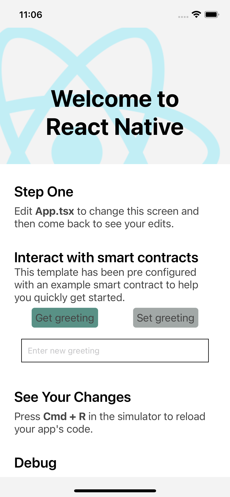

# react-native-blocks

<p align="center" >
  
</p>

<br/>

An opinionated template to bootstrap your next React Native Dapp with architecture and boilerplate to let you focus on writing features right away.

## :computer: Contributions are very welcome 🤝

Preconfigured with

- TypeScript
- [HardHat:](https://hardhat.org/)Ethereum development environment.
- [React Navigation:](https://reactnavigation.org/) (**v6**) for navigation and deeplinking.
- [AsyncStorage:](https://github.com/react-native-community/async-storage) An asynchronous, unencrypted, persistent, key-value storage system for React Native.
- [web3.js:](https://web3js.readthedocs.io/en/v1.7.4/#) A collection of libraries that allow you to interact with a local or remote ethereum node.
- [Ethers:](https://docs.ethers.io/v5/) Interact with the Ethereum Blockchain and its ecosystem.
- [WalletConnect:](https://docs.walletconnect.com/) Communicate securely between Wallets and Dapps.
- [react-native-svg:](https://github.com/react-native-community/react-native-svg) Provide SVG support.
- [react-native-gesture-handler:](https://docs.swmansion.com/react-native-gesture-handler/docs/) Recognizing pinch, rotation, pan and few other gestures.

## Contents

- [Documentation](#documentation)
- [Getting Started](#getting-started)
- [Required Steps](#required-steps)
- [Example](#example)

## Documentation

- [Libraries](#libraries)
- [Directory Structure](#directory-structure)
- [Quick Overview](#quick-overview)
- [File Walkthrough](./docs/file-walkthrough.md)

## Getting Started

Create a new project using the template.

- **Note:** the command will fail if you have the global legacy react-native-cli installed. Make sure you uninstall it first. More info at [react-native-community/cli](https://github.com/react-native-community/cli#about).

### RN 0.69.1

```bash
$ npx react-native init MyApp --template https://github.com/kpose/react-native-blocks
```

#### React Native <=> Template Version

| React Native | Template |
| ------------ | -------- |
| 0.69.1       | 1.0.0    |

## Required Steps

#### specify a deep link URI scheme

We have employed [WalletConnect](https://docs.walletconnect.com/) to easily help connect your React Native dapps to Ethereum Wallets on Android, iOS and the Web. The library is implemented using the React Context API, which is used to help make an instance of a connector accessible globally throughout your application.

To help control navigation between external wallets and your application. On the web, you only need to specify a valid application route; whereas on mobile platforms, you must [specify a deep link URI scheme](https://reactnavigation.org/docs/deep-linking/)

**Then, modify your app navigator linking**

```javascript
$ cd src/navigation/

//RootNavigator.tsx
...

const linking = {
  prefixes: ['yourdeeplinkuri://'],
};

...
<NavigationContainer
      linking={linking}
      fallback={<ActivityIndicator color="blue" size="large" />
      }>
      /* {AppStack} */
</NavigationContainer>
```

**Also, update walletconnect redirect url**

```javascript
$ cd src/

//App.tsx
...

const App = () => {
  const deepLinklUriScheme = 'yourdeeplinkuri://';

  return (
    <WalletConnectProvider
      redirectUrl={redirectUrl={Platform.OS === 'web' ? window.location.origin : deepLinklUriScheme}}
      storageOptions={{
        asyncStorage: AsyncStorage,
      }}>
      <RootNavigator />
    </WalletConnectProvider>
  );
};
```

## Example

As a guide, we have included an example smart contract, this contract have alreday been deployed on the blockchain. Our example will read and write data on the blockchain.

## Libraries

Let's briefly go over the benefit of each library included in this template.

### TypeScript

For type safety

But in all seriousness, if you are considering this template I assume you are a TypeScript fan.

### HardHat

To manage many of the tasks that are inherent to developing dApps and smart contracts, we provided a way to test, compile, deploy and debug dApps based on the Ethereum blockchain.

### Ethers

The ethers.js library aims to be a complete and compact library for interacting with the Ethereum Blockchain and its ecosystem.

### web3.js

web3.js is a collection of libraries that allow you to interact with a local or remote ethereum node using HTTP, IPC or WebSocket.

### WalletConnect

WalletConnect is the decentralized Web3 messaging layer and a standard to connect blockchain wallets to our dapps.

### react-native-svg

Prefer using SVG over images all the time (remember to optimize your SVGs).

### React Navigation

It is the most popular navigation library. For most apps, this is the best choice.

> _If you appreciate these libraries and find them useful, please consider supporting them._

## Directory Structure

```
root
├── __tests__
├── __bundle
├── android
├── artifacts
├── cache
├── contracts
├── ios
├── scripts
└── src
    └── hooks
    └── navigation
    └── screens
├── test
```

## Quick Overview

Quickly get an idea about each folder's role.

| Directory     | Short Description                                                                                                        |
| :------------ | :----------------------------------------------------------------------------------------------------------------------- |
| \_\_tests\_\_ | (Default; as per official template)                                                                                      |
| android       | Android project. Includes modifications to integrate libraries.                                                          |
| artifacts     | The directory where the compilation artifacts are stored.This is where you will find the successfully compiled contracts |
| cache         | The directory used by Hardhat to cache its internal stuff.                                                               |
| contracts     | This is where the source files for your contracts should be.                                                             |
| ios           | iOS project. Includes modifications to integrate libraries.                                                              |
| scripts       | Folder for your hardhat simple automation scripts go.                                                                    |
| src           | Most of the app's code is here.                                                                                          |
| test          | This directory where your smart contract solidity tests are located.                                                     |
| hooks         | Shared hooks.                                                                                                            |
| navigation    | Navigation service (navigate from outside React components).                                                             |
| screens       | Shared custom exceptions.                                                                                                |

## Credits

This template is modified from [react-native-typescript-template](https://github.com/react-native-community/react-native-template-typescript). Thank you ❤️
